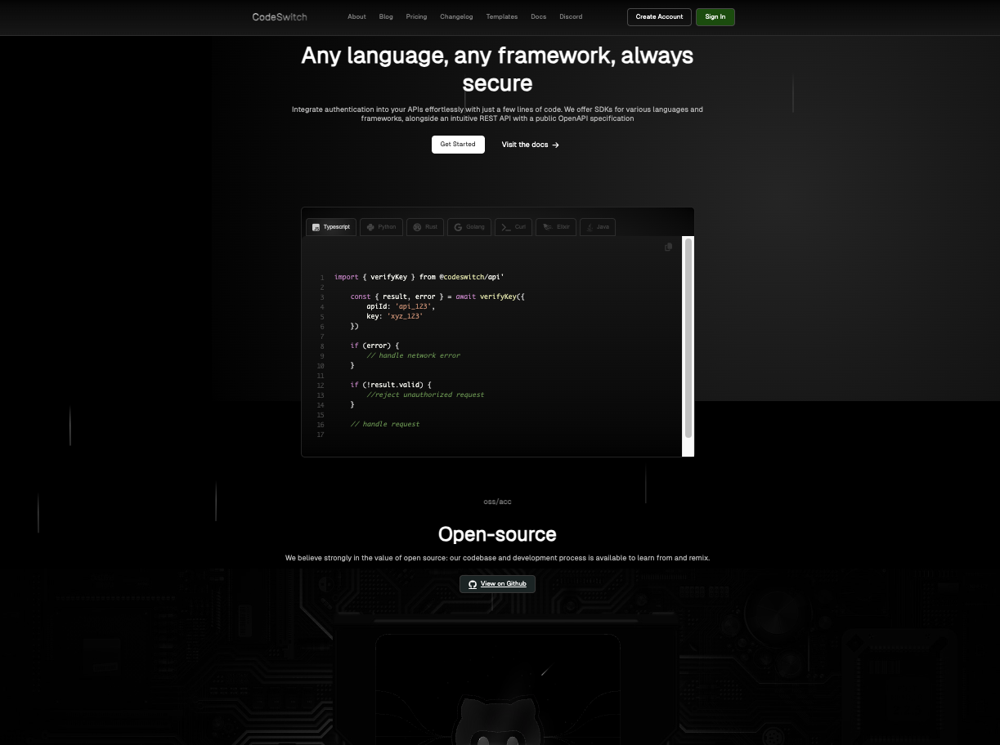

# Make It Decaf

A code switcher landing page featuring background animations, a custom Prism syntax theme, and active toggle menu. Built as a portfolio and skills-building project.

**Live demo:** [make-it-decaf.vercel.app](https://make-it-decaf.vercel.app/)

## About

This project is a landing page for a fictional API key authentication service (similar to [Unkey](https://unkey.dev/)). It showcases SDK code examples across seven languages with tabbed switching, syntax highlighting via [Prism.js](https://prismjs.com/), and scroll-triggered footer animations.

## Tech Stack

- HTML
- CSS
- JavaScript
- [Prism.js](https://prismjs.com/) for syntax highlighting
- Deployed on [Vercel](https://vercel.com/)

## Custom Prism Theme

None of the default Prism themes felt right for this build. Tried [G. Farhad's CodeMirror themes](https://github.com/FarhadG/code-mirror-themes) — starred for reference, but none were quite the fit either.

Used AI to pull colors from my personal website and generate a custom theme. Ultimately settled on a primarily Claude-inspired palette with off-white from my site, which also makes the SVG accent colors pop.

**TODO:** Download an official Prism theme stylesheet and make edits there rather than in `style.css`. Leaving as-is on GitHub for tinkering.

## Credit
Built by Heather Hugo
Inspired by [thehashton/codeswitcher](https://github.com/thehashton/codeswitcher/)